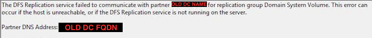
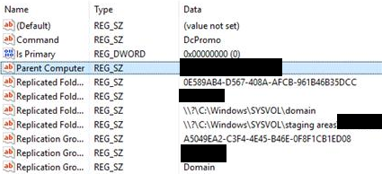

Let's say theoretically that a 2012 R2 domain controller (DC) did updates and failed to boot to Windows afterwards... 

Let's also say theoretically another technician decided the logical path forward was to forcibly remove this DC from the domain without performing a proper demotion...

([The proper methodology is outlined here by Microsoft, the first step is not to panic.](https://docs.microsoft.com/en-us/windows-server/identity/ad-ds/deploy/demoting-domain-controllers-and-domains--level-200-))

This left the environment in an interesting place.

Attempting to load any GPO's in the MMC snap-in would result in complaints about permissions and policy settings missing.

More alarmingly, we discovered that that the entire SYSVOL share contents were empty. Browsing to the DFS root namespace share revealed this right away.

`\\contoso.local\SYSVOL\contoso.local\policies`

Instead of seeing a mess of logon scripts, there was simply no contents at all. 

Forcibly removing this DC cleared out all of the policy files as well, meaning that this was the authoritative server in the DFS Replication Group. 

Luckily enough for us we had a copy of known working group policies from a backup and simply needed to restore the replication between DC's.

### Troubleshooting
One event log assisted us in finding the correct resolution to this problem, we'll go through it below.
### DFS-Replication Event ID 5008
<br/>
On a set interval, or every time we restarted DFS replication services, this event log would be recorded on all DC's in the domain. Note that Event ID 5008 was referencing the name of the old DC which had already been removed at this point.

```
The DFS Replication service failed to communicate with partner <OLD DC NAME> for replication group Domain System Volume. 

This error can occur if the host in unreachable, or if the DFS Replication service is not running on the server.

Partner DNS Address: <OLD DC FQDN>
``` 

## Resolution
### Step 1: Resetting the Authoritative DFS Server
Since every DC in the environment was logging a 5008, we gathered that the old DC being referenced was authoritative in the DFS replication group.

In order to change where all DC's gather their source content from, some work in ADSI must be completed. You can find more information about this process in the links below.

[3rd Party blog reference - does an excellent job describing.](https://jackstromberg.com/2014/07/sysvol-and-group-policy-out-of-sync-on-server-2012-r2-dcs-using-dfsr/)

[M$ troubleshooting steps - leaves out a few details.](https://support.microsoft.com/en-us/help/2218556/how-to-force-an-authoritative-and-non-authoritative-synchronization-fo)

Working through these steps we noticed that the old DC wasn't listed as a replication group member in ADSI.

Resetting which server was authoritative for the replication group in ADSI did help us in solving the problem.

However, once all of these steps were completed, event 5008 was still being recorded once the services came back up. Still referencing the old server too. Even worse, still no replication.

### Step 2: It's Always in the Registry
In our case the repliation group was reporting healthy, yet every DC in the environment still was looking for that missing DC as an authoratative DFS group member.

This was confirmed by running the following commands:
`dfsrdiag ReplicationState /all`
`repadmin /showrepl`

Domain Controllers will store additional configuration details for the "Domain System Volume" DFS Group within the registry. This will get modified when a demotion occurs successfully, in our case it was not. 

Configuration specifics for the DFS group can be found in here in the registry on each Domain Controller in the environment:
`HKLM\System\CurrentControlSet\Services\DFSR\`

The set of keys we are worried about in particular which reference the old Domain Controller are as follows:
`HKLM\System\CurrentControlSet\Services\DFSR\Parameters\SYSVOLS\Seeding Sysvols\`



Within this configuration the `Parent Computer` property was referencing the old Domain Controller.

Once discovered, we stopped the DFS Replication services on every DC and renamed the `Parent Computer` property to the new authoratative DFS DC name **on all Domain Controllers**.

After this setting was changed and the services were restarted almost instantaneously the SYSVOL contents replicated across the domain, and no more event ID 5008 referencing and old DC.