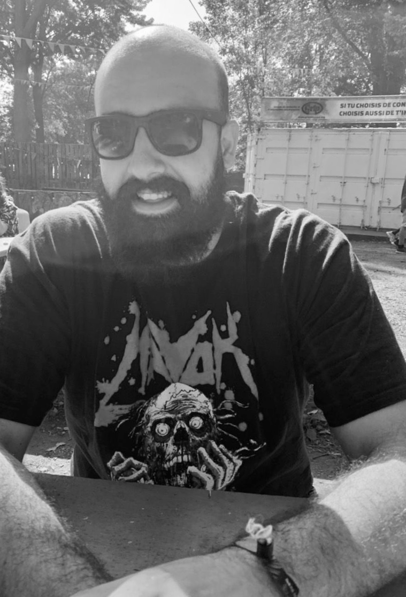

---
# This page uses Hydejack's `about` layout, which shows the primary author's picture and about text at the top.
# You can change it to the regular `page` layout if you want.
layout: about

# The title of the page.
title: About

# Write a short (~150 characters) description of each blog post.
# This description is used to preview the page on search engines, social media, etc.
description: >
  Everything I'm willing to let go about myself for free on the internet.

# You can show the description on the page by deleting this line:
hide_description: true

# TODO
image: /assets/img/egghead.png
---
Windows and cloud specialized former sysadmin with a background in development and a passion for security.

Currently architecting and delivering Microsoft centric projects as a consultant.

Located in Calgary, Alberta, Canada. 

You can find me actively contributing on NetSec Focus, a security focused group of like-minded technical individuals.
Feel free to join us on the Mattermost chat client **[here](a href="https://mm.netsecfocus.com/join">https://mm.netsecfocus.com/join)**

bigsweet, a silly nickname for a big, kind guy with a beard.

